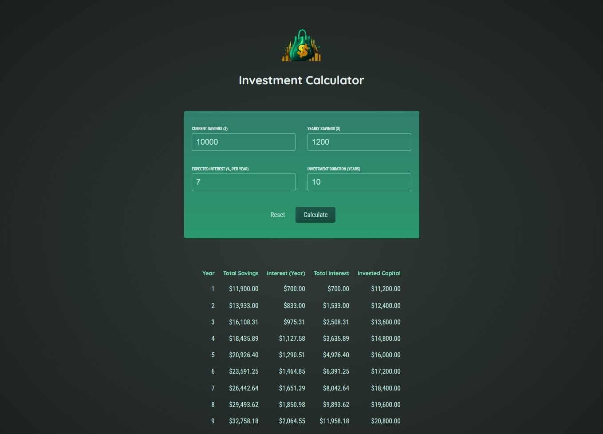

# Investment Calculator App

The Investment Calculator is a simple React.js application that helps users estimate their savings and interest over a specified investment duration. Users can input their current savings, yearly contribution, expected interest rate, and investment duration to calculate and visualize the potential growth of their investment.

## Table of Contents

- [Overview](#overview)
- [Components](#components)
- [Usage](#usage)
- [Preview](#preview)
- [Contributing](#contributing)

## Overview

The Investment Calculator App comprises several components, each playing a crucial role in the application's functionality:

- **App:** The main component managing the state of the application and rendering child components.
- **Header:** A simple header component displaying the logo and app title.
- **UserInput:** A form component allowing users to input their investment details.
- **ResultTable:** A table component displaying the calculated results based on user input.

## Components

### App Component (`App.js`)

The main component managing the state and rendering child components.

### Header Component (`Header.js`)

Displays the logo and title of the Investment Calculator.

### UserInput Component (`UserInput.js`)

A form component allowing users to input their investment details, including current savings, yearly contribution, expected return, and investment duration.

### ResultTable Component (`ResultTable.js`)

A table component displaying the calculated results, including total savings, yearly interest, total interest, and invested capital.

## Usage

1. Clone the repository:

   ```bash
   git clone https://github.com/Adhamxiii/investment-calculator-app.git
   ```

2. Change into the project directory:

    ```bash
    cd investment-calculator-app
    ```

3. Install dependencies:

    ```bash
    npm install
    ```

4. Run the development server:

    ```bash
    npm start
    ```

5. Open your browser and visit `http://localhost:3000`.

6. Use the app to calculate and visualize your potential investment growth.

## Preview



## Contributing

Contributions are welcome! If you find any issues or have suggestions for improvements, please open an issue or submit a pull request.

## Contact Me

If you have any questions or suggestions, feel free to contact me:

- GitHub: [Adham Nasser](https://github.com/Adhamxiii)
- Linkedin: [Adham Nasser](https://www.linkedin.com/in/adhamnasser/)
